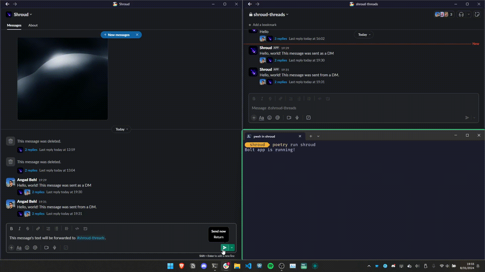

**This project has been moved to [hackclub/shroud](https://github.com/hackclub/shroud)**
# Shroud  
A Slack bot allowing for anonymous reports to be sent whilst allowing for bidirectional communication between the reporter and the recipient.  
[](shroud.mp4)

### Features
* Send anonymous reports
    * Reports are sent to a channel where recipient(s) can view them
    * The reports can be responded to, relaying the message to the anonymous reporter's DM with the bot

### Setup
1. Create a new Slack app at [api.slack.com/apps](https://api.slack.com/apps)  
2. Create an Airtable with three columns: `dm_ts`, `forwarded_ts`, `selection`, `selection_ts`, and `dm_channel`  
3. Use the `manifest.yml` file to create it  
4. Install the app to your workspace  
5. Clone the repository  
6. Copy `example.settings.toml` to `settings.toml` and fill in the values


### Installation  
#### Docker
Run the following command to build and run the Docker container:  
```sh
docker-compose up
```
If you want to run the container in the background, use the `-d` flag:  
```sh
docker-compose up -d
```

#### Poetry
If you want to run the server without Docker, you can use [Poetry](https://python-poetry.org/):    
```sh
poetry install
poetry run python -m shroud
```

### Usage
Upon a direct message being sent to the bot, the bot will forward the message to the specified channel. The recipient(s) can then respond to the message in the thread, which will be relayed to the anonymous reporter's DM with the bot.  
To clean broken database records, run the `/shroud-clean-db` command.  
